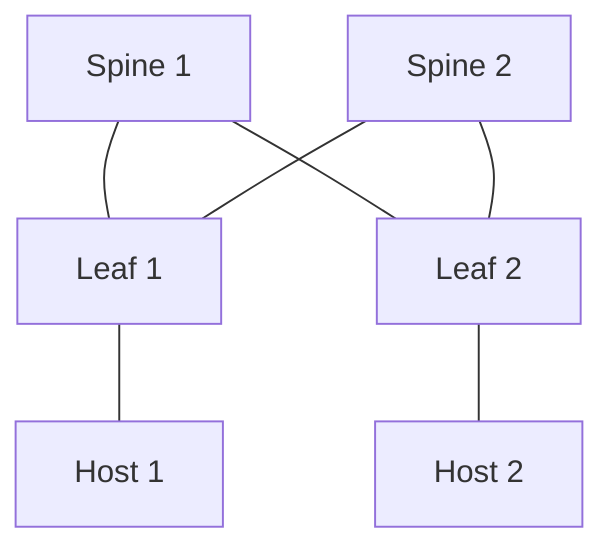

# Cisco Leaf-Spine Lab with Ansible on WSL

This guide walks you through setting up a Cisco Leaf-Spine network in Cisco Modeling Labs (CML) and automating configurations with Ansible in a WSL environment.



*Example 2-Spine / 2-Leaf topology. You can scale this as needed.*

---

## 1️⃣ Setup Leaf and Spine Switches in Cisco Modeling Lab (CML)
- Configure external connection to CML using **Bridge mode**.  
- Set the management IP (management VRF) of Nexus switches to match your external network (home VLAN).

---

## 2️⃣ Install WSL
From PowerShell:

```powershell
wsl --install
```

To install a specific Ubuntu distribution, list available distributions:

```powershell
wsl --list --online
```

Example:

```powershell
wsl --install -d Ubuntu-18.04
```

---

## 3️⃣ Install Visual Studio Code (VSC)
- Install Required Extensions:
  - **Remote - SSH**
  - **Remote - WSL**

- Connect to WSL  
  You can connect directly from Visual Studio Code to your WSL host.

---

## 4️⃣ Install Ansible and Create Development Environment
Update and install python3-venv:
```bash
sudo apt update && sudo apt install python3-venv -y
```

Create and activate a Python virtual environment:

python3 -m venv ~/ansible-venv
source ~/ansible-venv/bin/activate
```

Upgrade pip and install Ansible:

```bash
pip install --upgrade pip
pip install ansible ansible-pylibssh
```
*(Recommended to install via pip instead of `sudo apt install ansible` for a newer version.)*

---

## 5️⃣ Install NX-OS Modules

```bash
ansible-galaxy collection install cisco.nxos
```

---

## 6️⃣ Create Ansible Development Environment for NX-OS
Create a folder for virtual environments:

```bash
cd ~
mkdir venv
```

Create a Python virtual environment for Ansible:

```bash
python -m venv venv/ansible-dev
source venv/ansible-dev/bin/activate
```

Install required packages:

```bash
pip install --upgrade pip
pip install ansible-dev-tools
```

---

## 7️⃣ Create Ansible Inventory and Playbooks
**Hosts File**  
- Create a `hosts` file for Leaf switches.  
- Similar files can be made for Spine switches (though their configuration is more static).  

**Configuration File**  
- Create `config.yml` containing VRF and VLAN details.  

**Ansible Playbooks**  
- Create `.yml` files to:  
  - Create/Delete VLANs  
  - Create/Delete VRFs  
  - Configure BGP  

*Most automation work will focus on Leaf switches, but the same logic can be extended to Spine devices.*

---

## 📌 Quick Reference Commands

| Purpose                        | Command |
|--------------------------------|---------|
| Install WSL                    | `wsl --install` |
| List WSL Distros               | `wsl --list --online` |
| Install Ubuntu 18.04           | `wsl --install -d Ubuntu-18.04` |
| Update APT & Install Python venv | `sudo apt update && sudo apt install python3-venv -y` |
| Create Python venv             | `python3 -m venv ~/ansible-venv` |
| Activate venv                  | `source ~/ansible-venv/bin/activate` |
| Install Ansible via pip        | `pip install ansible ansible-pylibssh` |
| Install NX-OS modules          | `ansible-galaxy collection install cisco.nxos` |
| Install Dev Tools              | `pip install ansible-dev-tools` |

---

## ✅ Summary
This setup enables:

- Lab simulation of a **Leaf-Spine architecture** using Cisco Modeling Labs  
- Automated configuration management with **Ansible**  
- Modular playbooks for **VLAN, VRF, and BGP setup**  
- A clean folder structure for **scalable automation projects**
